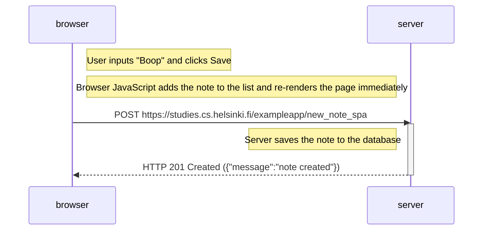

```mermaid
sequenceDiagram
    participant browser
    participant server

    Note right of browser: User inputs "Boop" and clicks Save

    Note right of browser: Browser JavaScript adds the note to the list and re-renders the page immediately

    browser->>server: POST https://studies.cs.helsinki.fi/exampleapp/new_note_spa
    activate server
    
    Note left of server: Server saves the note to the database
    
    server-->>browser: HTTP 201 Created ({"message":"note created"})
    deactivate server
```
